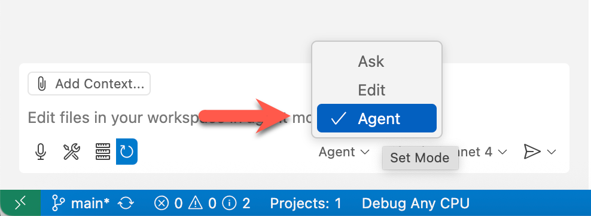

# 04: .NET Migration from JavaScript (Chuyển đổi từ JavaScript sang .NET)

## Bối cảnh

Contoso là một công ty bán các sản phẩm phục vụ nhiều hoạt động ngoài trời. Bộ phận marketing của Contoso muốn ra mắt một website mạng xã hội nhỏ theo hướng microservice để quảng bá sản phẩm tới khách hàng hiện tại và khách hàng tiềm năng.

Họ đã có sẵn một ứng dụng frontend viết bằng JavaScript, cụ thể hơn là React. Tuy nhiên, bất ngờ họ gửi yêu cầu mới: phát triển lại ứng dụng frontend bằng .NET, đặc biệt là Blazor.

Giờ đây, với vai trò là một .NET developer, bạn cần chuyển đổi ứng dụng React hiện tại sang Blazor. (Và bạn cũng chỉ biết rất ít về JavaScript và React.)

## Yêu cầu trước

Tham khảo tài liệu [README](../README.md) để chuẩn bị.

## Bắt đầu

- [Kiểm tra GitHub Copilot Agent Mode](#kiểm-tra-github-copilot-agent-mode)
- [Chuẩn bị Custom Instructions](#chuẩn-bị-custom-instructions)
- [Chuẩn bị dự án Blazor Web App](#chuẩn-bị-dự-án-blazor-web-app)
- [Chạy ứng dụng Spring Boot backend](#chạy-ứng-dụng-spring-boot-backend)
- [Chuyển đổi React Web App](#chuyển-đổi-react-web-app)
- [Xác minh Blazor Frontend App](#xác-minh-blazor-frontend-app)

### Kiểm tra GitHub Copilot Agent Mode

1. Nhấp biểu tượng GitHub Copilot ở phía trên của GitHub Codespace hoặc VS Code để mở cửa sổ GitHub Copilot.

   

1. Nếu được yêu cầu đăng nhập hoặc đăng ký, hãy thực hiện. GitHub Copilot có thể dùng miễn phí (tuỳ chính sách/điều kiện của bạn).
1. Đảm bảo bạn đang dùng GitHub Copilot ở chế độ Agent Mode.

   

1. Chọn model là `GPT-4.1` hoặc `Claude Sonnet 4`.
1. Đảm bảo bạn đã cấu hình [MCP Servers](./00-setup.md#set-up-mcp-servers).

### Chuẩn bị Custom Instructions

1. Thiết lập biến môi trường `$REPOSITORY_ROOT`.

   ```bash
   # bash/zsh
   REPOSITORY_ROOT=$(git rev-parse --show-toplevel)
   ```

   ```powershell
   # PowerShell
   $REPOSITORY_ROOT = git rev-parse --show-toplevel
   ```

1. Sao chép custom instructions.

    ```bash
    # bash/zsh
    cp -r $REPOSITORY_ROOT/docs/custom-instructions/dotnet/. \
          $REPOSITORY_ROOT/.github/
    ```

    ```powershell
    # PowerShell
    Copy-Item -Path $REPOSITORY_ROOT/docs/custom-instructions/dotnet/* `
              -Destination $REPOSITORY_ROOT/.github/ -Recurse -Force
    ```

### Chuẩn bị dự án Blazor Web App

1. Đảm bảo bạn đang dùng GitHub Copilot Agent Mode với model `Claude Sonnet 4` hoặc `GPT-4.1`.
1. Đảm bảo MCP server `context7` đang chạy.
1. Dùng prompt như bên dưới để scaffold một dự án Blazor web app.

    ```text
    I'd like to scaffold a Blazor web app. Follow the instructions below.

    - Use context7.
    - Your working directory is `dotnet`.
    - Identify all the steps first, which you're going to do.
    - Show me the list of .NET projects related to Blazor and ask me to choose.
    - Generate a Blazor project.
    - Use the project name of `Contoso.BlazorApp`.
    - Update `launchSettings.json` to change the port number of `3031` for HTTP, `43031` for HTTPS.
    - Create a solution, `ContosoWebApp`, and add the Blazor project into this solution.
    - Build the Blazor app and verify if the app is built properly.
    - Run this Blazor app and verify if the app is running properly.
    - If either building or running the app fails, analyze the issues and fix them.
    ```

1. Nhấp nút  trên GitHub Copilot để nhận (apply) các thay đổi.

### Chạy ứng dụng Spring Boot backend

1. Đảm bảo ứng dụng Spring Boot backend đang chạy.

    ```text
    Run the Spring Boot backend API, which is located at the `java` directory.
    ```

   > **LƯU Ý**: Bạn có thể dùng ứng dụng mẫu tại [complete/java](../complete/java/).

1. Nếu bạn dùng GitHub Codespaces, hãy đảm bảo port `8080` được đặt là `public` thay vì `private`. Nếu không, bạn sẽ gặp lỗi `401` khi frontend truy cập backend.

### Chuyển đổi React Web App

1. Đảm bảo bạn đang dùng GitHub Copilot Agent Mode với model `Claude Sonnet 4` hoặc `GPT-4.1`.
1. Đảm bảo MCP server `context7` đang chạy.
1. Dùng prompt như bên dưới để chuyển đổi React sang Blazor.

    ```text
    Now, we're migrating the existing React-based web app to Blazor web app. Follow the instructions below for the migration.
    
    - Use context7.
    - The existing React application is located at `javascript`.
    - Your working directory is `dotnet/Contoso.BlazorApp`.
    - Identify all the steps first, which you're going to do.
    - There's a backend API app running on `http://localhost:8080`.
    - Analyze the application structure of the existing React app.
    - Migrate all the React components to Blazor ones. Both corresponding components should be as exactly close to each other as possible.
    - Migrate all necessary CSS elements from React to Blazor.
    - While migrating JavaScript elements from React to Blazor, maximize using Blazor's native features as much as possible. If you have to use JavaScript, use Blazor's JSInterop features.
    - If necessary, add NuGet packages that are compatible with .NET 9.
    ```

1. Sau khi chuyển đổi xong, dùng prompt như bên dưới để kiểm tra kết quả build.

    ```text
    I'd like to build the Blazor app. Follow the instructions.

    - Use context7.
    - Build the Blazor app and verify if the app is built properly.
    - If building the app fails, analyze the issues and fix them.
    ```

   > **LƯU Ý**:
   >
   > - Lặp lại bước này cho đến khi build thành công.
   > - Nếu build cứ thất bại, hãy xem error message và hỏi GitHub Copilot Agent để cùng phân tích.

1. Nhấp nút  trên GitHub Copilot để nhận (apply) các thay đổi.
1. Khi build thành công, dùng prompt như bên dưới để chạy ứng dụng và kiểm tra kết quả.

    ```text
    I'd like to run the Blazor app. Follow the instructions.

    - Use context7.
    - Run this Blazor app and verify if the app is running properly.
    - Ignore backend API app connection error at this stage.
    - If running the app fails, analyze the issues and fix them.
    ```

### Xác minh Blazor Frontend App

1. Đảm bảo ứng dụng Spring Boot backend đang chạy.

    ```text
    Run the Spring Boot backend API, which is located at the `java` directory.
    ```

1. Nhấp nút  trên GitHub Copilot để nhận (apply) các thay đổi.
1. Xác minh ứng dụng build/chạy đúng.

    ```text
    Run the Blazor app and verify if the app is properly running.

    If app running fails, analyze the issues and fix them.
    ```

1. Mở trình duyệt và truy cập `http://localhost:3031`.
1. Kiểm tra cả frontend và backend có đang chạy bình thường hay không.
1. Nhấp nút  trên GitHub Copilot để nhận (apply) các thay đổi.

---

OK. Bạn đã hoàn thành bước ".NET". Hãy chuyển sang [STEP 05: Containerization](./05-containerization.md).
