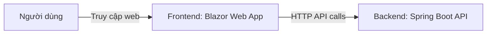
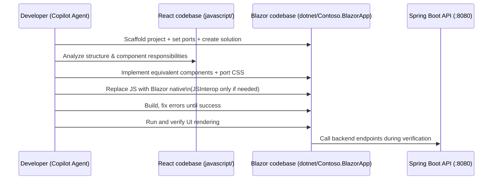

# Báo cáo: Chuyển đổi frontend từ React sang Blazor (04 - .NET Migration)

## 1. Giới thiệu

Trong bài lab này, mục tiêu là chuyển đổi (migrate) một ứng dụng frontend viết bằng React (JavaScript) sang .NET Blazor theo yêu cầu mới của Contoso.

Bối cảnh: Contoso muốn ra mắt một micro social media website để quảng bá sản phẩm. Họ đã có frontend React, nhưng yêu cầu chuyển sang Blazor. Backend API (Spring Boot) vẫn giữ nguyên.

Tài liệu tham khảo chính: docs/04-dotnet.md

## 2. Bối cảnh và mục tiêu

### 2.1. Bối cảnh

- Frontend hiện tại: React (nằm trong thư mục [javascript](javascript)).
- Yêu cầu mới: phát triển lại frontend bằng .NET, cụ thể là Blazor.
- Backend: Spring Boot API chạy tại `http://localhost:8080`.

### 2.2. Mục tiêu

- Tạo (scaffold) dự án Blazor Web App theo chuẩn .NET.
- Thiết lập port chạy ứng dụng Blazor:
  - HTTP: `3031`
  - HTTPS: `43031`
- Tạo solution `ContosoWebApp` và add project `Contoso.BlazorApp` vào solution.
- Chuyển đổi UI từ React sang Blazor:
  - Chuyển các component React sang component Blazor tương ứng.
  - Chuyển CSS cần thiết từ React sang Blazor.
  - Hạn chế dùng JavaScript; nếu cần thì dùng JSInterop.
- Build và chạy thử để xác nhận ứng dụng Blazor hoạt động.
- Kết nối với backend để xác minh frontend-backend chạy ổn.

## 3. Cách tiếp cận 

Để chuyển đổi từ React sang Blazor một cách có kiểm soát (không “dịch code” máy móc), bài làm được triển khai theo hướng: (1) chốt bài toán & tiêu chí đạt, (2) mô hình hoá cấu trúc và quy tắc ánh xạ, (3) hiện thực hoá theo cấu trúc repo/solution, và (4) kiểm chứng bằng build/run + tích hợp backend.

### 3.1. Đặt vấn đề và tiêu chí đạt

Frontend hiện tại là React, yêu cầu mới là Blazor nhưng phải giữ trải nghiệm/UI tương đương và tiếp tục dùng backend Spring Boot có sẵn. Vì vậy tiêu chí đạt được hiểu theo các điểm tối thiểu sau:

- Ứng dụng Blazor build/run được, đúng port.
- UI/luồng chính tương đương bản React (ít sai khác về bố cục/hành vi).
- Khi backend chạy, frontend gọi API được để hiển thị dữ liệu.

Sơ đồ bối cảnh để khoanh đúng ranh giới và trách nhiệm:



### 3.2. Mô hình hoá và quy tắc ánh xạ

Thay vì chuyển đổi từng file theo cảm tính, bài làm mô hình hoá cấu trúc UI/API và đặt quy tắc ánh xạ trước để giảm rủi ro “đúng cú pháp nhưng sai hành vi”.

Nguyên tắc khi migrate:

- Giữ “ý nghĩa” và “bố cục” UI tương đương: component nào có vai trò gì ở React thì sang Blazor vẫn giữ vai trò đó.
- Tách phần gọi API ra khỏi UI khi có thể (service layer) để dễ test/dễ bảo trì.
- Hạn chế JavaScript: ưu tiên cơ chế binding/event của Blazor; chỉ dùng JSInterop nếu thật sự cần.

Quy tắc ánh xạ React → Blazor (tóm tắt):

- JSX Component → Razor Component (`.razor`)
- Props → `[Parameter]`
- Local state (`useState`) → field/property + event handlers
- Side effects (`useEffect`) → lifecycle (`OnInitialized{Async}`, `OnParametersSet{Async}`)
- Fetch/Axios → `HttpClient` (thường bọc trong service)
- Routing (React Router) → `Router`/`NavLink`/pages trong Blazor
- CSS/Tailwind → static assets trong `wwwroot` (giữ tên lớp/selector nếu có thể)

Sơ đồ ánh xạ cấu trúc giúp nhìn rõ “nguồn → quy tắc → đích”:

```mermaid
flowchart TB
  subgraph R[React app (javascript/)]
    R1[Routes/Pages] --> R2[Components]
    R2 --> R3[Styles (CSS/Tailwind)]
    R2 --> R4[API calls]
  end

  subgraph M[Quy tắc ánh xạ]
    M1[Component parity]\n(UI tương đương)
    M2[CSS porting]\n(giữ selector)
    M3[Prefer Blazor native]\n(JSInterop nếu cần)
    M4[API via HttpClient]\n(service layer
  end

  subgraph B[Blazor app (dotnet/Contoso.BlazorApp)]
    B1[Pages (.razor)] --> B2[Components (.razor)]
    B2 --> B3[wwwroot assets]
    B2 --> B4[API services (HttpClient)]
    B2 --> B5[JSInterop (optional)]
  end

  R --> M --> B
```

### 3.3. Hiện thực hoá theo cấu trúc repo

Sau khi thống nhất tiêu chí và quy tắc ánh xạ, bước hiện thực hoá được neo vào các “điểm tựa vật lý” trong repo để dễ kiểm tra và dễ lặp:

- React nguồn: thư mục `javascript/`
- Blazor đích: `dotnet/Contoso.BlazorApp/` (trong solution `dotnet/ContosoWebApp.sln`)
- Backend API: chạy từ thư mục `java/` (hoặc dùng mẫu `complete/java/`)

Thiết lập port khi chạy local:

- Backend Spring Boot: `8080`
- Frontend Blazor: `3031` (HTTP), `43031` (HTTPS)

Sơ đồ luồng chạy local:

```mermaid
flowchart LR
  Browser[Browser] -->|http://localhost:3031| Blazor[Blazor (Kestrel)]
  Blazor -->|http://localhost:8080| Api[Spring Boot API]
```

Sơ đồ quy trình thực hiện (để thấy thứ tự thao tác và điểm kiểm chứng):



## 4. Chuẩn bị môi trường

### 4.1. Điều kiện trước

Thực hiện các bước chuẩn bị theo [README](README.md) ở thư mục gốc (đường dẫn tương đối từ docs/ là [README.md](README.md)).

### 4.2. Kiểm tra GitHub Copilot Agent Mode

- Mở GitHub Copilot trong VS Code / Codespaces.
- Bật Agent Mode.
- Chọn model: `GPT-4.1` hoặc `Claude Sonnet 4`.
- Đảm bảo đã cấu hình MCP Servers theo tài liệu setup: [docs/00-setup.md](docs/00-setup.md).

### 4.3. Chuẩn bị custom instructions

Thiết lập biến môi trường `REPOSITORY_ROOT` và copy custom instructions cho bài .NET:

Bash/Zsh:

```bash
REPOSITORY_ROOT=$(git rev-parse --show-toplevel)
cp -r $REPOSITORY_ROOT/docs/custom-instructions/dotnet/. \
      $REPOSITORY_ROOT/.github/
```

PowerShell:

```powershell
$REPOSITORY_ROOT = git rev-parse --show-toplevel
Copy-Item -Path $REPOSITORY_ROOT/docs/custom-instructions/dotnet/* `
          -Destination $REPOSITORY_ROOT/.github/ -Recurse -Force
```

Mục đích: giúp Copilot bám sát yêu cầu bài lab (scaffold Blazor/solution/ports, migration từ React) và giảm sai lệch khi sinh mã.

## 5. Chuẩn bị dự án Blazor Web App

### 5.1. Yêu cầu

- Làm việc trong thư mục `dotnet`.
- Tạo dự án Blazor có tên `Contoso.BlazorApp`.
- Cập nhật cấu hình chạy để dùng port:
  - HTTP: `3031`
  - HTTPS: `43031`
- Tạo solution `ContosoWebApp` và add project Blazor vào solution.
- Build và chạy thử; nếu lỗi thì phân tích và sửa.

### 5.2. Prompt tham khảo (dùng với Copilot Agent Mode)

```text
I'd like to scaffold a Blazor web app. Follow the instructions below.

- Use context7.
- Your working directory is `dotnet`.
- Identify all the steps first, which you're going to do.
- Show me the list of .NET projects related to Blazor and ask me to choose.
- Generate a Blazor project.
- Use the project name of `Contoso.BlazorApp`.
- Update `launchSettings.json` to change the port number of `3031` for HTTP, `43031` for HTTPS.
- Create a solution, `ContosoWebApp`, and add the Blazor project into this solution.
- Build the Blazor app and verify if the app is built properly.
- Run this Blazor app and verify if the app is running properly.
- If either building or running the app fails, analyze the issues and fix them.
```

### 5.3. Kết quả kỳ vọng

- Có solution `ContosoWebApp.sln`.
- Có project `Contoso.BlazorApp`.
- Chạy được ở `http://localhost:3031`.
- Build thành công (không lỗi restore/build).

## 6. Chạy backend Spring Boot

### 6.1. Mục tiêu

Đảm bảo backend API sẵn sàng để frontend gọi.

### 6.2. Prompt tham khảo

```text
Run the Spring Boot backend API, which is located at the `java` directory.
```

> **LƯU Ý**: Có thể dùng ứng dụng mẫu tại [complete/java](../complete/java/).

### 6.3. Minh chứng/Kiểm tra

- Backend chạy và lắng nghe tại `http://localhost:8080`.
- Nếu dùng Codespaces: port `8080` phải `public` để tránh lỗi `401` khi frontend truy cập.

## 7. Chuyển đổi React Web App sang Blazor

### 7.1. Phạm vi

- React app nguồn: thư mục `javascript`.
- Blazor app đích: `dotnet/Contoso.BlazorApp`.

### 7.2. Nguyên tắc migration

- Component mapping: React component ↔ Blazor component càng tương đồng càng tốt.
- CSS: chuyển các phần cần thiết để UI tương tự.
- JavaScript: ưu tiên Blazor native; nếu bắt buộc thì dùng JSInterop.
- Dependency: chỉ thêm NuGet package tương thích .NET 9 khi cần.

### 7.3. Prompt migration tham khảo

```text
Now, we're migrating the existing React-based web app to Blazor web app. Follow the instructions below for the migration.

- Use context7.
- The existing React application is located at `javascript`.
- Your working directory is `dotnet/Contoso.BlazorApp`.
- Identify all the steps first, which you're going to do.
- There's a backend API app running on `http://localhost:8080`.
- Analyze the application structure of the existing React app.
- Migrate all the React components to Blazor ones. Both corresponding components should be as exactly close to each other as possible.
- Migrate all necessary CSS elements from React to Blazor.
- While migrating JavaScript elements from React to Blazor, maximize using Blazor's native features as much as possible. If you have to use JavaScript, use Blazor's JSInterop features.
- If necessary, add NuGet packages that are compatible with .NET 9.
```

## 8. Build và chạy thử Blazor app

### 8.1. Build (kiểm tra compile)

Prompt build:

```text
I'd like to build the Blazor app. Follow the instructions.

- Use context7.
- Build the Blazor app and verify if the app is built properly.
- If building the app fails, analyze the issues and fix them.
```

Ghi chú:

- Lặp lại cho đến khi build thành công.
- Nếu lỗi lặp đi lặp lại, dùng error message để yêu cầu Copilot phân tích sâu hơn.

### 8.2. Run (kiểm tra runtime)

Prompt run:

```text
I'd like to run the Blazor app. Follow the instructions.

- Use context7.
- Run this Blazor app and verify if the app is running properly.
- Ignore backend API app connection error at this stage.
- If running the app fails, analyze the issues and fix them.
```

Kết quả kỳ vọng:

- Blazor app chạy ổn ở `http://localhost:3031`.
- UI render không lỗi (có thể tạm thời lỗi gọi API nếu backend chưa sẵn sàng).

## 9. Xác minh tích hợp frontend-backend

### 9.1. Prompt xác minh

```text
Run the Blazor app and verify if the app is properly running.

If app running fails, analyze the issues and fix them.
```

### 9.2. Các bước kiểm tra

- Đảm bảo backend Spring Boot đang chạy.
- Mở trình duyệt và truy cập `http://localhost:3031`.
- Kiểm tra:
  - Trang load thành công
  - Gọi API không bị lỗi CORS/401/500 (tuỳ tình trạng cấu hình)
  - Chức năng hiển thị dữ liệu cơ bản hoạt động

## 10. Kết luận

Bài lab 04 hoàn thành khi:

- Dự án Blazor `Contoso.BlazorApp` đã được scaffold đúng yêu cầu, nằm trong solution `ContosoWebApp`.
- Frontend Blazor chạy được trên port `3031`.
- UI đã được chuyển đổi từ React sang Blazor (component + CSS) theo mức độ tương đồng hợp lý.
- Khi backend Spring Boot chạy, frontend có thể truy cập và hiển thị dữ liệu qua API.

---

OK. Đã hoàn thành bước ".NET". Chuyển sang [STEP 05: Containerization](./05-containerization.md).
